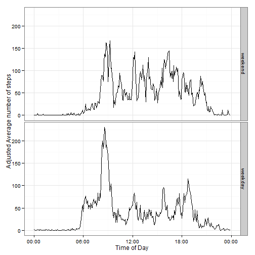

# Reproducible Research: Peer Assessment 1
==========================================

## Introduction

This assignment makes use of data from a personal activity monitoring device. 
This device collects data at 5 minute intervals through out the day. The data 
consists of two months of data from an anonymous individual collected during 
the months of October and November, 2012 and include the number of steps taken 
in 5 minute intervals each day.   

## Data
   
The data for this assignment can be downloaded from the course web site:   
Dataset: [Activity monitoring data](http://d396qusza40orc.cloudfront.net/repdata/data/activity.zip) [52K]

The variables included in this dataset are:

* **steps**: Number of steps taking in a 5-minute interval (missing values are 
coded as `NA`)
* **date**: The date on which the measurement was taken in YYYY-MM-DD format
* **interval**: Identifier for the 5-minute interval in which measurement was 
taken in HHMM format

The dataset is stored in a comma-separated-value (CSV) file and there are a 
total of 17,568 observations in this dataset.


## Loading and preprocessing the data
The data is downloaded directly from the course website, using **download.file** 
and then unzipped to get the dataset. 

```r
zipFileLoc <- "http://d396qusza40orc.cloudfront.net/repdata/data/activity.zip"
tzf <- tempfile(tmpdir=tempdir(), fileext=".zip")
download.file(zipFileLoc, tzf)
dateDownloaded <- date()
paste("Data downloaded on: ", dateDownloaded)
```

```
## [1] "Data downloaded on:  Fri Jul 18 18:10:39 2014"
```

```r
unzip(tzf, exdir=getwd(), overwrite=TRUE)
```


This dataset is read into a data frame using **read.csv** using default 
NA identifier, and the columns are read in as numeric, and two strings 
respectively. 


```r
act <- read.csv("activity.csv", colClasses = c("numeric","character","character"))
str(act)
```

```
## 'data.frame':	17568 obs. of  3 variables:
##  $ steps   : num  NA NA NA NA NA NA NA NA NA NA ...
##  $ date    : chr  "2012-10-01" "2012-10-01" "2012-10-01" "2012-10-01" ...
##  $ interval: chr  "0" "5" "10" "15" ...
```

The "interval" will be modified and combined with the date column to generate
a date-time variable.


```r
act$interval <- formatC(as.numeric(act$interval), width = 4, format = "d", 
                        flag = "0") 
act$datetime <- strptime(paste(act$date,act$interval), "%Y-%m-%d %H%M")
str(act)
```

```
## 'data.frame':	17568 obs. of  4 variables:
##  $ steps   : num  NA NA NA NA NA NA NA NA NA NA ...
##  $ date    : chr  "2012-10-01" "2012-10-01" "2012-10-01" "2012-10-01" ...
##  $ interval: chr  "0000" "0005" "0010" "0015" ...
##  $ datetime: POSIXlt, format: "2012-10-01 00:00:00" "2012-10-01 00:05:00" ...
```

A new factor column is added to indicate whether the reading pertains to a 
weekday or weekend.


```r
act$wday <- cut((act$datetime$wday+1)%%7, c(-0.5,1.5,6.5),
                labels=c("weekend","weekday"))
str(act)
```

```
## 'data.frame':	17568 obs. of  5 variables:
##  $ steps   : num  NA NA NA NA NA NA NA NA NA NA ...
##  $ date    : chr  "2012-10-01" "2012-10-01" "2012-10-01" "2012-10-01" ...
##  $ interval: chr  "0000" "0005" "0010" "0015" ...
##  $ datetime: POSIXlt, format: "2012-10-01 00:00:00" "2012-10-01 00:05:00" ...
##  $ wday    : Factor w/ 2 levels "weekend","weekday": 2 2 2 2 2 2 2 2 2 2 ...
```


## What is mean total number of steps taken per day?
We first sum up the steps on each day and compute the daily number of steps. _**If 
for any day we only have NA values, these are ignored as specified in the 
instructions**_. We then plot the 
histogram based on these values and report the mean and median of these values. 
We also plot these on the histogram. Since the mean and median are very close
the mean line is overwritten by median


```r
dailySteps <- aggregate(steps ~ date, act, sum)
meanSteps <- mean(dailySteps$steps)
medianSteps <- median(dailySteps$steps)
hist(dailySteps$steps, breaks=10, xlab="Daily Step Count", main="")
legend("topright", lty=1, col=c("blue", "green"), legend=c("mean","median"))
abline(v=meanSteps,col="blue")
abline(v=medianSteps,col="green")
```

 

```r
paste("Mean daily steps =", meanSteps, " Median daily steps =", medianSteps)
```

```
## [1] "Mean daily steps = 10766.1886792453  Median daily steps = 10765"
```


## What is the average daily activity pattern?
We first compute the average number of steps taken in each 5 min interval. We 
use this data to generate the line chart.


```r
intvlSteps <- aggregate(steps ~ interval, act, mean)
intvlSteps$time <- strptime(intvlSteps$interval, "%H%M")
library(ggplot2)
library(scales)
qplot(intvlSteps$time, intvlSteps$steps, geom="line",
      xlab="Time of Day", ylab = "Average number of steps")+theme_bw() +
    scale_x_datetime(breaks = pretty_breaks(), labels=date_format("%H:%M"))
```

 
   
   
   We find the maximum steps across all periods of the day and then find the 
period/s where it occurrs.


```r
maxSteps <- max(intvlSteps$steps)
tod <- subset(intvlSteps, steps==maxSteps)$time
paste("Maximum steps in a day occur at :", format(tod, "%H:%M"))
```

```
## [1] "Maximum steps in a day occur at : 08:35"
```


## Imputing missing values

Total number of missing values is calculated by computing sum of is.na for steps.

```r
naRecs <- sum(is.na(act$steps))
paste("Number of records with missing values is :", naRecs)
```

```
## [1] "Number of records with missing values is : 2304"
```

Missing values are to be filled in with the mean number of steps at the same 
time across other days. To do this, we first add another column which has the 
mean value of time of day repeated for all entries. Then we use either the 
steps column if it is available or the mean column if steps is NA.

```r
act$meanSteps <- intvlSteps$steps
act$adjSteps <- act$steps
act$adjSteps[is.na(act$adjSteps)] <- act$meanSteps[is.na(act$adjSteps)]
```

We generate the new histogram and report the new mean and median, in a manner 
similar to how we computed these earlier.


```r
dailyAdjSteps <- aggregate(adjSteps ~ date, act, sum)
meanAdjSteps <- mean(dailyAdjSteps$adjSteps)
medianAdjSteps <- median(dailyAdjSteps$adjSteps)
hist(dailyAdjSteps$adjSteps, breaks=10, xlab="Daily Adjusted Step Count",
     main="")
legend("topright", lty=1, col=c("blue", "green"), legend=c("mean","median"))
abline(v=meanAdjSteps,col="blue")
abline(v=medianAdjSteps,col="green")
```

 
   
These are practically the same as the ones reported earlier. The reason for 
this is that the data values were either missing for the entire day, or were 
available for the entire day. So in the histogram, the only change we see is 
that the peak at the center is more pronounced (24 compared to 16). 


```r
paste("Mean daily adjusted steps =", meanAdjSteps, 
      " Median daily adjusted steps =", medianAdjSteps)
```

```
## [1] "Mean daily adjusted steps = 10766.1886792453  Median daily adjusted steps = 10766.1886792453"
```
As we are adding multiple days each with the same exact number of steps as the
mean, the mean does not change . Also the Median 
reported earlier was (incidentally) very close to the mean, and now with more 
values being added at mean, the median becomes the same as mean, while earlier 
the median was slightly lower. 


## Are there differences in activity patterns between weekdays and weekends?

We aggregate the steps across the interval column and weekday/weekend factor 
column. Then we use this data to plot a faceted line plot showing different 
plots for weekday and weekend.


```r
wdayEndSteps <- aggregate(steps ~ interval+wday, act, mean)
wdayEndSteps$time <- strptime(wdayEndSteps$interval, "%H%M")
qplot(time, steps, data=wdayEndSteps, geom="line", facets=wday ~ . ,
      xlab="Time of Day", ylab = "Average number of steps")+theme_bw() +
    scale_x_datetime(breaks = pretty_breaks(), labels=date_format("%H:%M"))
```

 
   
   
As can be seen in these plots, the behavior on weekday and weekend are quite 
different. On the weekdays, activity starts from 6:00 AM and there is a big 
spike from 8:10 until 9:10; probably corresponding to a commute to work. After 
this the level of actvity is lower until 6:10 PM until 7:10, probably the 
commute back. The weekend activity starts quite a bit later at around 8:00 AM.
The activity continues reasonably consistently throughout the day until 9:00 PM
, unlike the weekdays where it is quite low except for the periods of morning 
and evening commutes.  
   
We also generate the same plots with the adjusted step counts, and quite 
unsurprisingly observe that the shapes are quite similar to earlier plots,
and primarily just the total counts have increased proportionally.


```r
wdayEndAdjSteps <- aggregate(adjSteps ~ interval+wday, act, mean)
wdayEndAdjSteps$time <- strptime(wdayEndAdjSteps$interval, "%H%M")
qplot(time, adjSteps, data=wdayEndAdjSteps, geom="line", facets=wday ~ . ,
      xlab="Time of Day", ylab = "Adjusted Average number of steps")+theme_bw() +
    scale_x_datetime(breaks = pretty_breaks(), labels=date_format("%H:%M"))
```

 

